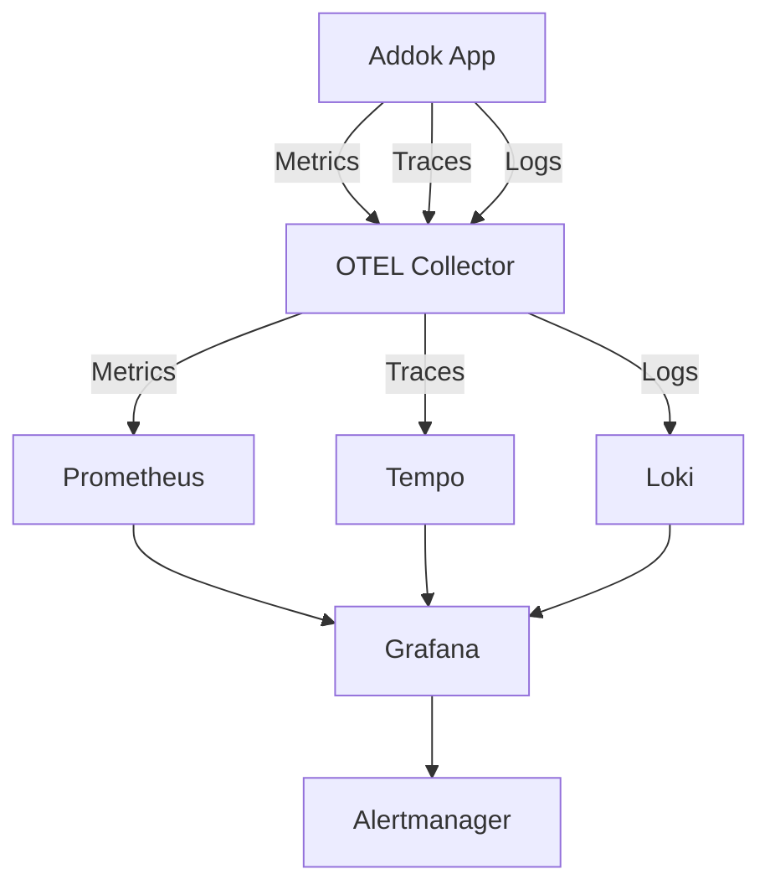

# Addok Application Monitoring & Observability Implementation

## Executive Summary

This document provides a comprehensive **OpenTelemetry-based monitoring and observability strategy** for the Addok geocoding service, designed to integrate seamlessly with your existing **Grafana, Prometheus, Tempo, and Alloy** stack. This replaces the disabled Datadog implementation with a more flexible, vendor-neutral observability solution.

## Current State Analysis

### Existing Monitoring Infrastructure
- ✅ **Prometheus**: Metrics collection and storage
- ✅ **Grafana**: Visualization and alerting
- ✅ **Tempo**: Distributed tracing backend
- ✅ **Alloy**: Data collection pipeline
- ❌ **Application Instrumentation**: Missing (Datadog disabled)

### Current Application State
- **ddtrace** library installed but non-functional
- Environment variables configured for Datadog (unused)
- Basic health check endpoints available
- No custom metrics or distributed tracing active

---

## 🎯 OpenTelemetry Implementation Strategy

### Architecture Overview



---

## 📦 Implementation Plan

### Phase 1: Application Instrumentation

#### Step 1: Update Dockerfile Dependencies

**File**: `addok/Dockerfile`
```dockerfile
# Replace ddtrace with OpenTelemetry
RUN pip install --no-cache-dir \
    cython \
    addok \
    addok-fr==1.0.1 \
    addok-france==1.1.3 \
    addok-csv==1.1.0 \
    addok-sqlite-store==1.0.1 \
    gunicorn==23.0.0 \
    # OpenTelemetry packages
    opentelemetry-api==1.21.0 \
    opentelemetry-sdk==1.21.0 \
    opentelemetry-auto-instrumentation==0.42b0 \
    opentelemetry-exporter-otlp==1.21.0 \
    opentelemetry-instrumentation-flask==0.42b0 \
    opentelemetry-instrumentation-redis==0.42b0 \
    opentelemetry-instrumentation-sqlite3==0.42b0 \
    opentelemetry-instrumentation-requests==0.42b0 \
    opentelemetry-propagator-b3==1.21.0 \
    python-geohash==0.8.5 \
    setuptools>=78.1.1 \
    pip>=23.3

# Remove Datadog environment variables
# ENV DD_SERVICE="addok"           # REMOVE
# ENV DD_ENV="production"          # REMOVE  
# ENV DD_VERSION="2.1.0"          # REMOVE
# ENV DD_TRACE_ENABLED="true"     # REMOVE
# ENV DD_LOGS_INJECTION="true"    # REMOVE

# Add OpenTelemetry environment variables
ENV OTEL_SERVICE_NAME="addok-ban"
ENV OTEL_SERVICE_VERSION="2.1.4"
ENV OTEL_RESOURCE_ATTRIBUTES="service.name=addok-ban,service.version=2.1.4,deployment.environment=production"
ENV OTEL_EXPORTER_OTLP_ENDPOINT="http://alloy:4317"
ENV OTEL_EXPORTER_OTLP_PROTOCOL="grpc"
ENV OTEL_TRACES_EXPORTER="otlp"
ENV OTEL_METRICS_EXPORTER="otlp"
ENV OTEL_LOGS_EXPORTER="otlp"
ENV OTEL_PYTHON_LOGGING_AUTO_INSTRUMENTATION_ENABLED="true"
```

#### Step 2: Application Instrumentation Code

Create `addok/monitoring/telemetry.py`:
```python
import os
import logging
from typing import Dict, Any
from opentelemetry import trace, metrics
from opentelemetry.sdk.trace import TracerProvider
from opentelemetry.sdk.trace.export import BatchSpanProcessor
from opentelemetry.sdk.metrics import MeterProvider
from opentelemetry.sdk.metrics.export import PeriodicExportingMetricReader
from opentelemetry.exporter.otlp.proto.grpc.trace_exporter import OTLPSpanExporter
from opentelemetry.exporter.otlp.proto.grpc.metric_exporter import OTLPMetricExporter
from opentelemetry.instrumentation.flask import FlaskInstrumentor
from opentelemetry.instrumentation.redis import RedisInstrumentor
from opentelemetry.instrumentation.sqlite3 import SQLite3Instrumentor
from opentelemetry.instrumentation.requests import RequestsInstrumentor
from opentelemetry.sdk.resources import Resource

logger = logging.getLogger(__name__)

class AddokTelemetry:
    """Centralized telemetry configuration for Addok"""
    
    def __init__(self):
        self.resource = self._create_resource()
        self.tracer_provider = None
        self.meter_provider = None
        self.tracer = None
        self.meter = None
        self.metrics = {}
        
    def _create_resource(self) -> Resource:
        """Create OpenTelemetry resource with service information"""
        return Resource.create({
            "service.name": os.getenv("OTEL_SERVICE_NAME", "addok-ban"),
            "service.version": os.getenv("OTEL_SERVICE_VERSION", "2.1.4"),
            "deployment.environment": os.getenv("DEPLOYMENT_ENV", "production"),
            "k8s.namespace.name": os.getenv("K8S_NAMESPACE", "addok-ban"),
            "k8s.pod.name": os.getenv("K8S_POD_NAME", "unknown"),
            "k8s.node.name": os.getenv("K8S_NODE_NAME", "unknown"),
        })
    
    def initialize_tracing(self):
        """Initialize distributed tracing"""
        try:
            # Configure tracer provider
            self.tracer_provider = TracerProvider(resource=self.resource)
            trace.set_tracer_provider(self.tracer_provider)
            
            # Configure OTLP exporter
            otlp_exporter = OTLPSpanExporter(
                endpoint=os.getenv("OTEL_EXPORTER_OTLP_ENDPOINT", "http://alloy:4317"),
                insecure=True
            )
            
            # Add batch span processor
            span_processor = BatchSpanProcessor(otlp_exporter)
            self.tracer_provider.add_span_processor(span_processor)
            
            # Get tracer
            self.tracer = trace.get_tracer(__name__)
            
            logger.info("OpenTelemetry tracing initialized successfully")
            
        except Exception as e:
            logger.error(f"Failed to initialize tracing: {e}")
            
    def initialize_metrics(self):
        """Initialize metrics collection"""
        try:
            # Configure OTLP metrics exporter
            metric_exporter = OTLPMetricExporter(
                endpoint=os.getenv("OTEL_EXPORTER_OTLP_ENDPOINT", "http://alloy:4317"),
                insecure=True
            )
            
            # Configure metric reader
            metric_reader = PeriodicExportingMetricReader(
                exporter=metric_exporter,
                export_interval_millis=5000,  # Export every 5 seconds
            )
            
            # Configure meter provider
            self.meter_provider = MeterProvider(
                resource=self.resource,
                metric_readers=[metric_reader]
            )
            metrics.set_meter_provider(self.meter_provider)
            
            # Get meter
            self.meter = metrics.get_meter(__name__)
            
            # Initialize custom metrics
            self._initialize_custom_metrics()
            
            logger.info("OpenTelemetry metrics initialized successfully")
            
        except Exception as e:
            logger.error(f"Failed to initialize metrics: {e}")
    
    def _initialize_custom_metrics(self):
        """Initialize application-specific metrics"""
        self.metrics = {
            # Request counters
            'geocoding_requests_total': self.meter.create_counter(
                "addok_geocoding_requests_total",
                description="Total number of geocoding requests",
                unit="1"
            ),
            'geocoding_requests_duration': self.meter.create_histogram(
                "addok_geocoding_request_duration_seconds",
                description="Duration of geocoding requests in seconds",
                unit="s"
            ),
            
            # CSV processing metrics
            'csv_uploads_total': self.meter.create_counter(
                "addok_csv_uploads_total",
                description="Total number of CSV uploads",
                unit="1"
            ),
            'csv_rows_processed': self.meter.create_counter(
                "addok_csv_rows_processed_total",
                description="Total number of CSV rows processed",
                unit="1"
            ),
            'csv_processing_duration': self.meter.create_histogram(
                "addok_csv_processing_duration_seconds",
                description="Duration of CSV processing in seconds",
                unit="s"
            ),
            
            # Cache metrics
            'cache_hits_total': self.meter.create_counter(
                "addok_cache_hits_total",
                description="Total number of cache hits",
                unit="1"
            ),
            'cache_misses_total': self.meter.create_counter(
                "addok_cache_misses_total",
                description="Total number of cache misses",
                unit="1"
            ),
            
            # Error metrics
            'errors_total': self.meter.create_counter(
                "addok_errors_total",
                description="Total number of errors",
                unit="1"
            ),
            
            # Performance metrics
            'active_requests': self.meter.create_up_down_counter(
                "addok_active_requests",
                description="Number of active requests",
                unit="1"
            ),
            'redis_connection_pool_size': self.meter.create_up_down_counter(
                "addok_redis_connection_pool_size",
                description="Redis connection pool size",
                unit="1"
            ),
        }
    
    def initialize_auto_instrumentation(self, app):
        """Initialize automatic instrumentation for frameworks"""
        try:
            # Flask instrumentation
            FlaskInstrumentor().instrument_app(app)
            
            # Redis instrumentation  
            RedisInstrumentor().instrument()
            
            # SQLite instrumentation
            SQLite3Instrumentor().instrument()
            
            # Requests instrumentation
            RequestsInstrumentor().instrument()
            
            logger.info("Auto-instrumentation initialized successfully")
            
        except Exception as e:
            logger.error(f"Failed to initialize auto-instrumentation: {e}")
    
    def record_geocoding_request(self, endpoint: str, status: str, duration: float, 
                               query_length: int = 0, results_count: int = 0):
        """Record metrics for geocoding requests"""
        attributes = {
            "endpoint": endpoint,
            "status": status,
            "query_length_range": self._get_length_range(query_length),
            "results_range": self._get_results_range(results_count)
        }
        
        self.metrics['geocoding_requests_total'].add(1, attributes)
        self.metrics['geocoding_requests_duration'].record(duration, attributes)
    
    def record_csv_processing(self, operation: str, rows_count: int, 
                            duration: float, success: bool):
        """Record metrics for CSV processing"""
        attributes = {
            "operation": operation,
            "success": str(success).lower(),
            "rows_range": self._get_rows_range(rows_count)
        }
        
        self.metrics['csv_uploads_total'].add(1, attributes)
        self.metrics['csv_rows_processed'].add(rows_count, attributes)
        self.metrics['csv_processing_duration'].record(duration, attributes)
    
    def record_cache_hit(self, cache_type: str):
        """Record cache hit"""
        self.metrics['cache_hits_total'].add(1, {"cache_type": cache_type})
    
    def record_cache_miss(self, cache_type: str):
        """Record cache miss"""
        self.metrics['cache_misses_total'].add(1, {"cache_type": cache_type})
    
    def record_error(self, error_type: str, endpoint: str):
        """Record application error"""
        attributes = {"error_type": error_type, "endpoint": endpoint}
        self.metrics['errors_total'].add(1, attributes)
    
    def _get_length_range(self, length: int) -> str:
        """Get query length range for metrics"""
        if length <= 10: return "0-10"
        elif length <= 50: return "11-50"
        elif length <= 100: return "51-100"
        else: return "100+"
    
    def _get_results_range(self, count: int) -> str:
        """Get results count range for metrics"""
        if count == 0: return "0"
        elif count <= 5: return "1-5"
        elif count <= 20: return "6-20"
        else: return "20+"
    
    def _get_rows_range(self, rows: int) -> str:
        """Get CSV rows range for metrics"""
        if rows <= 100: return "0-100"
        elif rows <= 1000: return "101-1000"
        elif rows <= 10000: return "1001-10000"
        else: return "10000+"

# Global telemetry instance
telemetry = AddokTelemetry()
```

#### Step 3: Flask Application Integration

Update `addok/http/wsgi.py`:
```python
import os
import logging
from flask import Flask, request, jsonify, g
from opentelemetry import trace
from .monitoring.telemetry import telemetry
import time

# Initialize logging
logging.basicConfig(level=logging.INFO)
logger = logging.getLogger(__name__)

def create_app():
    app = Flask(__name__)
    
    # Initialize OpenTelemetry
    telemetry.initialize_tracing()
    telemetry.initialize_metrics()
    telemetry.initialize_auto_instrumentation(app)
    
    @app.before_request
    def before_request():
        """Track request start time and active requests"""
        g.start_time = time.time()
        telemetry.metrics['active_requests'].add(1)
        
        # Add trace attributes
        span = trace.get_current_span()
        if span:
            span.set_attribute("http.user_agent", request.headers.get("User-Agent", ""))
            span.set_attribute("http.remote_addr", request.remote_addr or "")
            span.set_attribute("addok.query", request.args.get("q", "")[:100])  # Limit length
    
    @app.after_request
    def after_request(response):
        """Record request metrics"""
        duration = time.time() - g.get('start_time', time.time())
        telemetry.metrics['active_requests'].add(-1)
        
        # Record geocoding metrics
        endpoint = request.endpoint or "unknown"
        status = "success" if 200 <= response.status_code < 300 else "error"
        
        query = request.args.get("q", "")
        results_count = 0
        
        # Try to extract results count from response
        try:
            if response.content_type == "application/json":
                data = response.get_json()
                if isinstance(data, dict) and "features" in data:
                    results_count = len(data["features"])
        except:
            pass
        
        telemetry.record_geocoding_request(
            endpoint=endpoint,
            status=status, 
            duration=duration,
            query_length=len(query),
            results_count=results_count
        )
        
        # Add response headers for tracing
        span = trace.get_current_span()
        if span and span.get_span_context().trace_id:
            response.headers['X-Trace-Id'] = format(span.get_span_context().trace_id, '032x')
        
        return response
    
    @app.errorhandler(Exception)
    def handle_error(error):
        """Record error metrics"""
        endpoint = request.endpoint or "unknown"
        error_type = type(error).__name__
        
        telemetry.record_error(error_type, endpoint)
        
        logger.error(f"Unhandled error in {endpoint}: {error}", exc_info=True)
        
        return jsonify({
            "error": error_type,
            "message": "Internal server error",
            "trace_id": format(trace.get_current_span().get_span_context().trace_id, '032x') 
        }), 500
    
    return app

# Create application instance
application = create_app()
```

### Phase 2: Kubernetes Configuration

#### Step 1: Update Deployment Environment Variables

**File**: `30-api-deployment.yaml`
```yaml
env:
# Remove Datadog variables
# - name: DD_SERVICE
#   value: "addok-ban"
# - name: DD_ENV  
#   value: "production"
# - name: DD_VERSION
#   value: "2.1.4"
# - name: DD_AGENT_HOST
#   value: "datadog-agent.datadog.svc.cluster.local"
# - name: DD_TRACE_ENABLED
#   value: "true"
# - name: DD_LOGS_INJECTION
#   value: "true"

# Add OpenTelemetry variables
- name: OTEL_SERVICE_NAME
  value: "addok-ban"
- name: OTEL_SERVICE_VERSION
  value: "2.1.4"
- name: OTEL_EXPORTER_OTLP_ENDPOINT
  value: "http://alloy.monitoring.svc.cluster.local:4317"
- name: OTEL_EXPORTER_OTLP_PROTOCOL
  value: "grpc"
- name: OTEL_RESOURCE_ATTRIBUTES
  value: "service.name=addok-ban,service.version=2.1.4,deployment.environment=production"
- name: OTEL_TRACES_EXPORTER
  value: "otlp"
- name: OTEL_METRICS_EXPORTER
  value: "otlp"
- name: OTEL_LOGS_EXPORTER
  value: "otlp"
- name: OTEL_PYTHON_LOGGING_AUTO_INSTRUMENTATION_ENABLED
  value: "true"

# Kubernetes-specific environment variables
- name: K8S_NAMESPACE
  valueFrom:
    fieldRef:
      fieldPath: metadata.namespace
- name: K8S_POD_NAME
  valueFrom:
    fieldRef:
      fieldPath: metadata.name
- name: K8S_NODE_NAME
  valueFrom:
    fieldRef:
      fieldPath: spec.nodeName
```

#### Step 2: Add ServiceMonitor for Prometheus

Create `32-servicemonitor.yaml`:
```yaml
apiVersion: monitoring.coreos.com/v1
kind: ServiceMonitor
metadata:
  name: addok-ban-metrics
  namespace: addok-ban
  labels:
    app: addok-ban
    release: prometheus
spec:
  selector:
    matchLabels:
      app: addok-ban
  endpoints:
  - port: http
    path: /metrics
    interval: 15s
    scrapeTimeout: 10s
  namespaceSelector:
    matchNames:
    - addok-ban
```

#### Step 3: Add Prometheus Metrics Endpoint

Create `addok/monitoring/metrics_endpoint.py`:
```python
from flask import Blueprint, Response
from prometheus_client import generate_latest, CollectorRegistry, CONTENT_TYPE_LATEST
from prometheus_client import Counter, Histogram, Gauge, Info
import psutil
import os

# Create blueprint for metrics
metrics_bp = Blueprint('metrics', __name__)

# Create custom registry
registry = CollectorRegistry()

# Application info
app_info = Info('addok_application_info', 'Application information', registry=registry)
app_info.info({
    'version': os.getenv('OTEL_SERVICE_VERSION', '2.1.4'),
    'python_version': f"{sys.version_info.major}.{sys.version_info.minor}.{sys.version_info.micro}",
    'environment': os.getenv('DEPLOYMENT_ENV', 'production')
})

# System metrics
memory_usage = Gauge('addok_memory_usage_bytes', 'Memory usage in bytes', registry=registry)
cpu_usage = Gauge('addok_cpu_usage_percent', 'CPU usage percentage', registry=registry)
open_files = Gauge('addok_open_files', 'Number of open files', registry=registry)

@metrics_bp.route('/metrics')
def metrics():
    """Prometheus metrics endpoint"""
    try:
        # Update system metrics
        process = psutil.Process()
        memory_info = process.memory_info()
        memory_usage.set(memory_info.rss)
        cpu_usage.set(process.cpu_percent())
        
        try:
            open_files.set(process.num_fds())
        except AttributeError:
            # Windows doesn't have num_fds
            pass
        
        # Generate Prometheus metrics
        return Response(generate_latest(registry), mimetype=CONTENT_TYPE_LATEST)
        
    except Exception as e:
        logger.error(f"Error generating metrics: {e}")
        return Response("# Error generating metrics\n", mimetype=CONTENT_TYPE_LATEST)
```

### Phase 3: Grafana Dashboards

#### Dashboard 1: Addok Overview

Create `monitoring/grafana-dashboards/addok-overview.json`:
```json
{
  "dashboard": {
    "id": null,
    "title": "Addok Geocoding Service Overview",
    "tags": ["addok", "geocoding"],
    "timezone": "browser",
    "panels": [
      {
        "id": 1,
        "title": "Request Rate",
        "type": "stat",
        "targets": [
          {
            "expr": "rate(addok_geocoding_requests_total[5m])",
            "legendFormat": "{{endpoint}}"
          }
        ],
        "gridPos": {"h": 8, "w": 12, "x": 0, "y": 0}
      },
      {
        "id": 2,
        "title": "Response Time (95th percentile)",
        "type": "stat",
        "targets": [
          {
            "expr": "histogram_quantile(0.95, rate(addok_geocoding_request_duration_seconds_bucket[5m]))",
            "legendFormat": "P95 latency"
          }
        ],
        "gridPos": {"h": 8, "w": 12, "x": 12, "y": 0}
      },
      {
        "id": 3,
        "title": "Error Rate",
        "type": "timeseries",
        "targets": [
          {
            "expr": "rate(addok_errors_total[5m])",
            "legendFormat": "{{error_type}}"
          }
        ],
        "gridPos": {"h": 8, "w": 24, "x": 0, "y": 8}
      },
      {
        "id": 4,
        "title": "Cache Hit Rate", 
        "type": "timeseries",
        "targets": [
          {
            "expr": "rate(addok_cache_hits_total[5m]) / (rate(addok_cache_hits_total[5m]) + rate(addok_cache_misses_total[5m])) * 100",
            "legendFormat": "Cache hit rate %"
          }
        ],
        "gridPos": {"h": 8, "w": 12, "x": 0, "y": 16}
      },
      {
        "id": 5,
        "title": "Active Requests",
        "type": "timeseries", 
        "targets": [
          {
            "expr": "addok_active_requests",
            "legendFormat": "Active requests"
          }
        ],
        "gridPos": {"h": 8, "w": 12, "x": 12, "y": 16}
      }
    ],
    "time": {"from": "now-1h", "to": "now"},
    "refresh": "5s"
  }
}
```

#### Dashboard 2: CSV Processing

Create `monitoring/grafana-dashboards/addok-csv.json`:
```json
{
  "dashboard": {
    "id": null,
    "title": "Addok CSV Processing",
    "tags": ["addok", "csv", "batch"],
    "timezone": "browser",
    "panels": [
      {
        "id": 1,
        "title": "CSV Upload Rate",
        "type": "timeseries",
        "targets": [
          {
            "expr": "rate(addok_csv_uploads_total[5m])",
            "legendFormat": "{{operation}}"
          }
        ]
      },
      {
        "id": 2,
        "title": "CSV Processing Duration",
        "type": "timeseries",
        "targets": [
          {
            "expr": "histogram_quantile(0.95, rate(addok_csv_processing_duration_seconds_bucket[5m]))",
            "legendFormat": "P95 processing time"
          }
        ]
      },
      {
        "id": 3,
        "title": "Rows Processed Rate",
        "type": "timeseries",
        "targets": [
          {
            "expr": "rate(addok_csv_rows_processed_total[5m])",
            "legendFormat": "Rows/second"
          }
        ]
      }
    ]
  }
}
```

### Phase 4: Alerting Rules

#### Create `monitoring/alerts/addok-alerts.yaml`:
```yaml
groups:
- name: addok.rules
  rules:
  
  # High error rate
  - alert: AddokHighErrorRate
    expr: rate(addok_errors_total[5m]) > 0.1
    for: 2m
    labels:
      severity: warning
      service: addok-ban
    annotations:
      summary: "High error rate in Addok service"
      description: "Addok error rate is {{ $value }} errors/second"
  
  # High response time
  - alert: AddokHighResponseTime
    expr: histogram_quantile(0.95, rate(addok_geocoding_request_duration_seconds_bucket[5m])) > 1
    for: 5m
    labels:
      severity: warning
      service: addok-ban
    annotations:
      summary: "High response time in Addok service"
      description: "Addok 95th percentile response time is {{ $value }}s"
  
  # Low cache hit rate
  - alert: AddokLowCacheHitRate
    expr: rate(addok_cache_hits_total[10m]) / (rate(addok_cache_hits_total[10m]) + rate(addok_cache_misses_total[10m])) < 0.7
    for: 10m
    labels:
      severity: warning
      service: addok-ban
    annotations:
      summary: "Low cache hit rate in Addok service" 
      description: "Addok cache hit rate is {{ $value | humanizePercentage }}"
  
  # Service down
  - alert: AddokServiceDown
    expr: up{job="addok-ban"} == 0
    for: 1m
    labels:
      severity: critical
      service: addok-ban
    annotations:
      summary: "Addok service is down"
      description: "Addok service has been down for more than 1 minute"
  
  # High memory usage
  - alert: AddokHighMemoryUsage
    expr: addok_memory_usage_bytes / (1024*1024*1024) > 0.8
    for: 5m
    labels:
      severity: warning
      service: addok-ban
    annotations:
      summary: "High memory usage in Addok service"
      description: "Addok memory usage is {{ $value }}GB"
```

### Phase 5: Alloy Configuration

#### Update Alloy configuration to collect traces

Create `monitoring/alloy/addok-traces.alloy`:
```hcl
// OTLP receiver for traces
otelcol.receiver.otlp "addok" {
  grpc {
    endpoint = "0.0.0.0:4317"
  }
  
  http {
    endpoint = "0.0.0.0:4318"
  }

  output {
    traces = [otelcol.processor.batch.addok.input]
  }
}

// Batch processor for performance
otelcol.processor.batch "addok" {
  timeout = "1s"
  send_batch_size = 1024

  output {
    traces = [otelcol.exporter.otlp.tempo.input]
  }
}

// Export to Tempo
otelcol.exporter.otlp "tempo" {
  client {
    endpoint = "http://tempo:4317"
    tls {
      insecure = true
    }
  }
}

// Prometheus metrics from OpenTelemetry
otelcol.receiver.otlp "addok_metrics" {
  grpc {
    endpoint = "0.0.0.0:4317"
  }

  output {
    metrics = [otelcol.processor.batch.addok_metrics.input]
  }
}

otelcol.processor.batch "addok_metrics" {
  output {
    metrics = [otelcol.exporter.prometheus.default.input]
  }
}

otelcol.exporter.prometheus "default" {
  forward_to = [prometheus.remote_write.default.receiver]
}

prometheus.remote_write "default" {
  endpoint {
    url = "http://prometheus:9090/api/v1/write"
  }
}
```

---

## 🚀 Deployment Guide

### Step 1: Build Updated Images
```bash
# Build new image with OpenTelemetry
cd addok/
docker build -t pack-solutions/addok:2.1.5-otel .

# Tag for registry
docker tag pack-solutions/addok:2.1.5-otel registry.gitlab.com/atafaya971/packsol/addok-ban:2.1.5
```

### Step 2: Update Kubernetes Deployment
```bash
# Update image in deployment
kubectl set image deployment/addok-ban addok-ban=registry.gitlab.com/atafaya971/packsol/addok-ban:2.1.5 -n addok-ban

# Apply ServiceMonitor
kubectl apply -f 32-servicemonitor.yaml

# Verify rollout
kubectl rollout status deployment/addok-ban -n addok-ban
```

### Step 3: Import Grafana Dashboards
```bash
# Import dashboards via API
curl -X POST http://grafana:3000/api/dashboards/db \
  -H "Content-Type: application/json" \
  -d @monitoring/grafana-dashboards/addok-overview.json

curl -X POST http://grafana:3000/api/dashboards/db \
  -H "Content-Type: application/json" \
  -d @monitoring/grafana-dashboards/addok-csv.json
```

### Step 4: Configure Alerting
```bash
# Apply alert rules to Prometheus
kubectl apply -f monitoring/alerts/addok-alerts.yaml
```

---

## 📊 Monitoring Capabilities

### Metrics Available

#### Application Metrics
- `addok_geocoding_requests_total` - Total geocoding requests
- `addok_geocoding_request_duration_seconds` - Request latency
- `addok_csv_uploads_total` - CSV upload count
- `addok_csv_rows_processed_total` - Processed CSV rows
- `addok_cache_hits_total` / `addok_cache_misses_total` - Cache performance
- `addok_errors_total` - Application errors
- `addok_active_requests` - Concurrent requests

#### System Metrics  
- `addok_memory_usage_bytes` - Memory consumption
- `addok_cpu_usage_percent` - CPU utilization
- `addok_open_files` - File descriptor usage

### Tracing Capabilities
- **End-to-end request tracing** across Flask → Redis → SQLite
- **Distributed tracing** for CSV processing workflows
- **Error tracing** with full stack traces
- **Performance profiling** with span timing data

### Log Integration
- **Structured logging** with trace correlation
- **Error logs** with trace context
- **Performance logs** for slow queries
- **Audit logs** for administrative operations

---

## 🎯 Success Metrics

### Performance KPIs
- **Response Time P95**: < 100ms for single queries
- **Throughput**: > 500 requests/second
- **Cache Hit Rate**: > 90%
- **Error Rate**: < 0.1%

### Reliability KPIs  
- **Uptime**: 99.99%
- **MTTR**: < 5 minutes
- **Alert Response Time**: < 2 minutes

### Operational KPIs
- **Trace Coverage**: 100% of requests traced
- **Metrics Availability**: 99.9% data availability
- **Dashboard Load Time**: < 3 seconds

This comprehensive monitoring implementation provides complete observability for the Addok geocoding service, replacing Datadog with a flexible, vendor-neutral OpenTelemetry solution that integrates seamlessly with your existing Grafana, Prometheus, Tempo, and Alloy infrastructure.